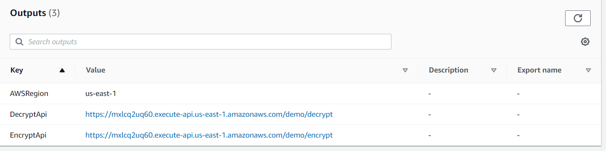
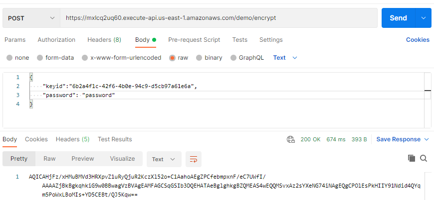
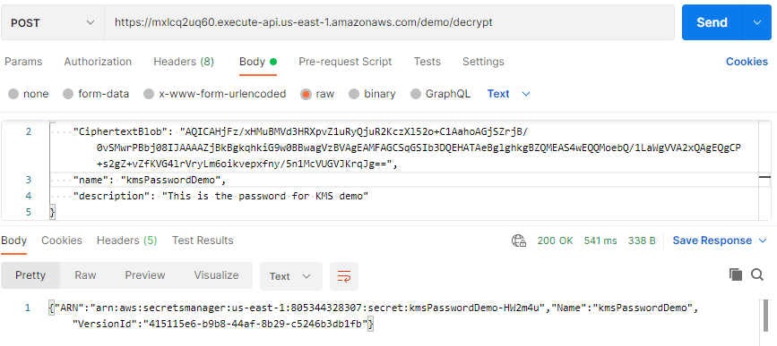
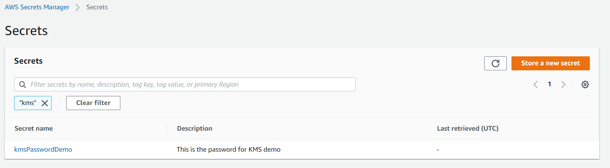
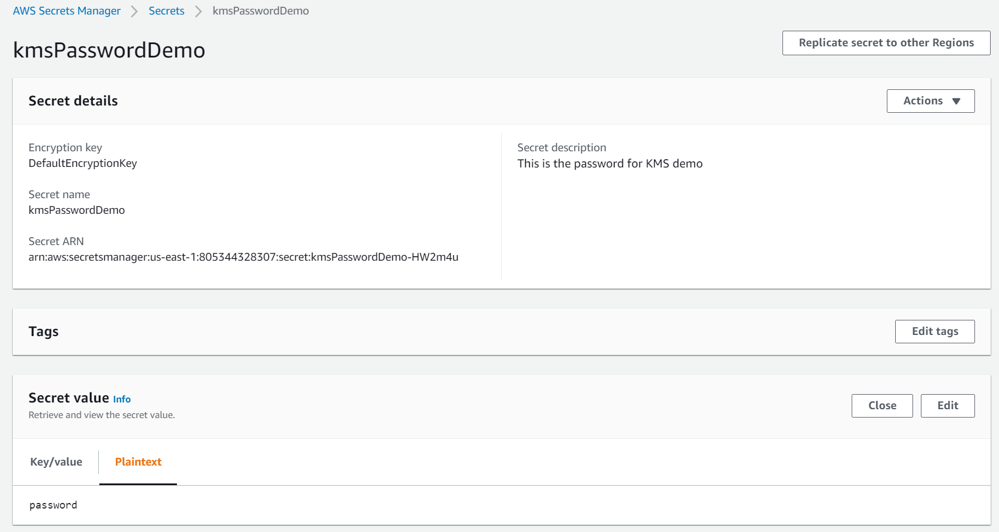

# KMS Demo
A KMS demo application to demonstrate a KMS encrypt and decrypt for passwords storing it in Secret Manager.

## Deployment

### Prerequisites

* [Node.js version 12.0.0 or later](https://nodejs.org/) to run Node scripts
* [AWS account](https://aws.amazon.com/) to create resources
* [AWS CLI version 2](https://docs.aws.amazon.com/cli/latest/userguide/install-cliv2.html) to run scripts
* [Git Bash](https://git-scm.com/) to run Bash scripts (only on Windows)

### 1) Configure AWS CLI

Run `aws configure` to set your credentials and the region where you want the demo resources deployed.

> **Important Note:**<br>
> - The Key ID from KMS **must** be created at the **same Region** of the rest of the stack.
### 2) Run deployment script

Go to the **deployment** folder and run:

`bash deploy.sh`.

This will deploy the demo infrastructure in AWS.

## Usage

At the end of the deploy.sh execution, you will see in the output of CloudFormation the **DecryptApi** and **EncryptApi** endpoints.



<br>

Now you can *Encrypt* and *Decrypt* the password storing it in Secret Manager.
### Encrypt your password
Go to **Postman** (or any API client) to use the service with the following parameters:

```shell
{
    "keyid": "<Key ID>",
    "password": "<Password you want to encrypt>"
}
```

> **Important Notes:**<br>
> - The Key ID **must** exist and your Account ID **must** have permission on it.
> - The Key ID **must** be created at the **same Region** of the rest of the stack.

The output will be the *CiphertextBlob* as follow:



<br>

### Decrypt your password
Go to **Postman** (or any API client) to use the service with the following parameters:
```shell
{
    "CiphertextBlob": "<CiphertextBlob provided by the encryption process>",
    "name": "<Name of the password in Secret Manager>",
    "description": "<A description for Secret Manager>"
}
```
The output will be the *ARN* of the item added in Secret Manager as follow:



<br>

We can check this new item in Secret Manager:



<br>

And take a look for the encrypted password:



<br>

## Working Example

The following parameters can be used for an actual working environment:

- Keyid: "6b2a4f1c-42f6-4b0e-94c9-d5cb97a61e6a"
- EncryptAPI: https://mxlcq2uq60.execute-api.us-east-1.amazonaws.com/demo/encrypt
- DecryptAPI: https://mxlcq2uq60.execute-api.us-east-1.amazonaws.com/demo/decrypt

> **Note:**<br>
> You would be able to decrypt and store a secret but not to see it in Secret Manager as you would need a user for that.